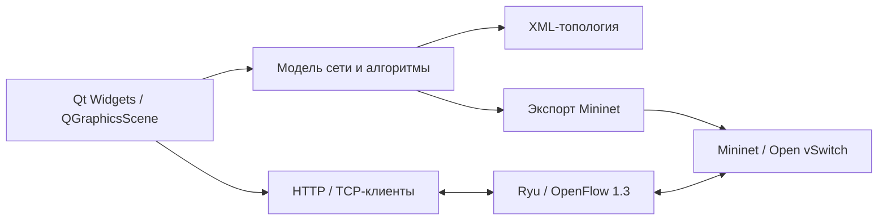

# SDN Topology (SNet)

Графический редактор программно-конфигурируемых сетей на **C++ и Qt 5**. Проект объединяет создание топологии, визуализацию алгоритмов маршрутизации и подготовку экспериментов в Mininet с контроллером Ryu.

Пет-проект для портфолио в области сетевых технологий и разработки desktop-приложений.

## Возможности

- Редактирование сети на графическом холсте: коммутаторы, хосты, SDN-контроллеры, Docker-узлы и связи.
- Настройка пропускной способности, задержки и потерь каналов.
- Сохранение и загрузка топологий в XML, экспорт Python-сценариев для Mininet.
- Алгоритмы Дейкстры, парных переходов, LARAC и жадного сегментирования.
- Подсветка маршрутов и сегментов, анимация передачи пакетов.
- Запуск Mininet и Ryu, сетевые проверки ping/iperf и мониторинг через HTTP.
- Управление проектами, отмена и повтор действий, светлая и тёмная темы.

## Архитектура



| Каталог | Содержимое |
| --- | --- |
| `Core/` | Модель сети, алгоритмы, импорт/экспорт, проекты и undo/redo |
| `UI/` | Окна, диалоги и интерактивный холст |
| `Network/` | HTTP/TCP-интеграции и мониторинг |
| `Utils/` | Вспомогательные функции |
| `resources/` | Темы оформления и Python-шаблоны Ryu |
| `images/` | Ресурсы интерфейса |
| `examples/basic/` | Пример XML-топологии и экспортированного Mininet-сценария |
| `tools/` | Генератор демо и отдельные C++-сценарии воспроизведения ошибок |

## Сборка редактора

Основная среда для сетевых экспериментов — Linux с графическим окружением. Для редактора нужны компилятор C++11, make, qmake и Qt 5 с модулями Widgets, SVG, XML, Network и PrintSupport.

Для Debian/Ubuntu:

```bash
sudo apt-get update
sudo apt-get install build-essential qtbase5-dev qt5-qmake libqt5svg5-dev
bash build.sh
./dist/SNet
```

Сборка выполняется в `build/`, исполняемый файл копируется в `dist/`. Библиотеки Qt должны быть установлены в системе. В Qt Creator можно открыть `SNet.pro` и выбрать комплект Qt 5.

## Первый эксперимент

1. Запустите редактор и откройте XML-файл `examples/basic/topology.sdn.xml` через действие открытия топологии либо создайте новый проект из шаблона.
2. Измените параметры каналов и сравните маршруты с помощью доступных алгоритмов.
3. Для эмуляции установите Mininet, Open vSwitch и совместимое окружение Ryu; для Docker-узлов дополнительно нужны Docker и Containernet.
4. Запустите контроллер, затем экспортированный Mininet-сценарий.

Пример ручного запуска в двух терминалах из корня репозитория, когда зависимости уже установлены:

```bash
# Терминал 1: Ryu из настроенного Python-окружения
cd resources/templates/ryu
ryu-manager --observe-links --ofp-tcp-listen-port 6653 --wsapi-port 8080 ryu_app_controller.py
```

```bash
# Терминал 2: Mininet из системного Python
sudo python3 examples/basic/topology.sdn.py
# В приглашении mininet>:
pingall
exit
```

Пример содержит два хоста, четыре коммутатора и контроллер `127.0.0.1:6653`. Эмуляция требует прав администратора; сам редактор запускается обычным пользователем.

## Ограничения и проверка

Для генерации дополнительных демонстрационных проектов выполните `python3 tools/gen_demo_topologies.py`. Они появятся в `demo-projects/`; можно задать другую новую папку через `--output`. Генератор откажется перезаписывать существующий каталог.

Это экспериментальный проект. Визуализация алгоритмов в редакторе и фактическая пересылка пакетов контроллером — отдельные части системы; совпадение результатов следует проверять в конкретном эксперименте. Базовый шаблон Ryu использует обучение MAC-адресов.

Mininet и запуск внешних процессов ориентированы на Linux. Полный сетевой сценарий требует отдельно настроенной среды; зависимости Ryu/Containernet не зафиксированы в этом репозитории. Совместимость со всеми версиями Python и Qt 6 не заявлена.

GitHub Actions настроен на сборку редактора с Qt 5 в Ubuntu 22.04 и проверку синтаксиса Python. Эта проверка не заменяет запуск GUI и интеграционные тесты Mininet/Ryu.

## Лицензия

В исходном проекте присутствует лицензия [Apache License 2.0](LICENSE.md); её текст сохранён.
